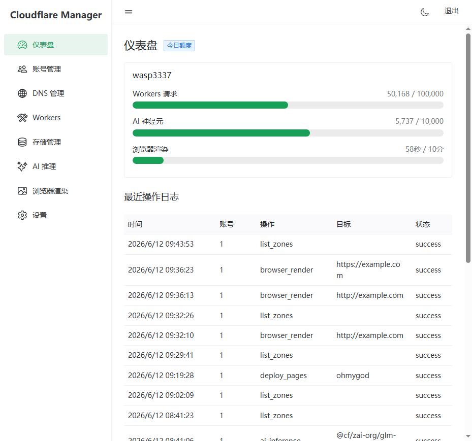
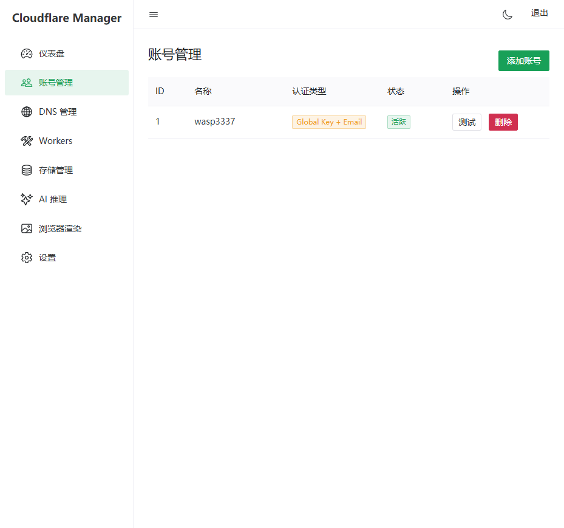
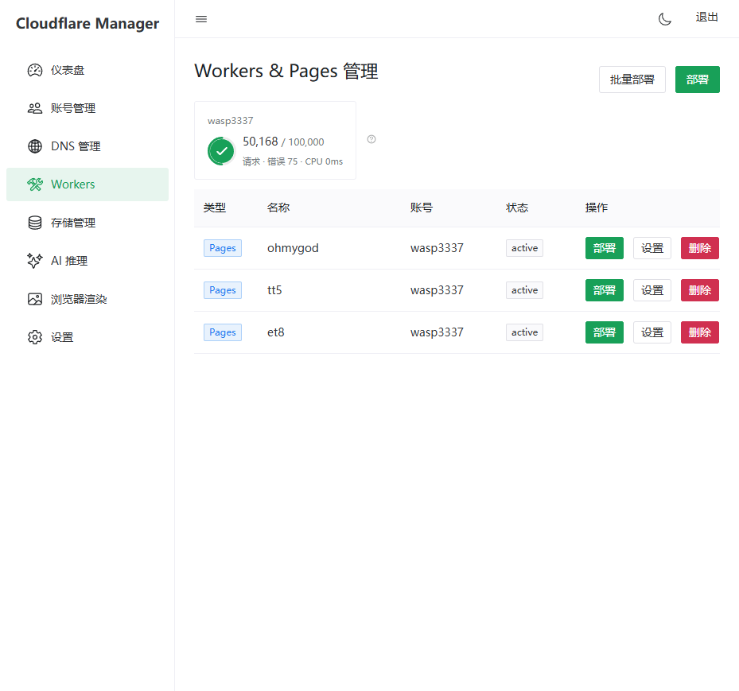
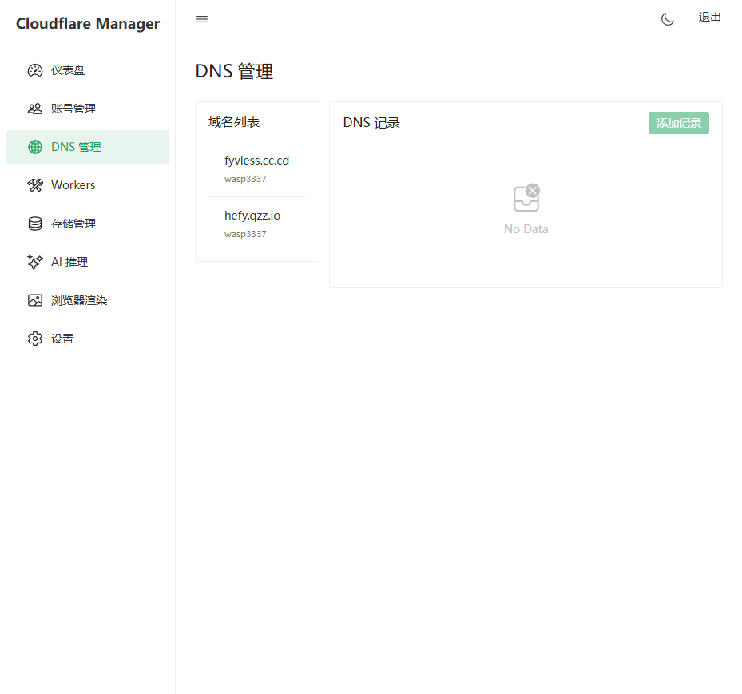
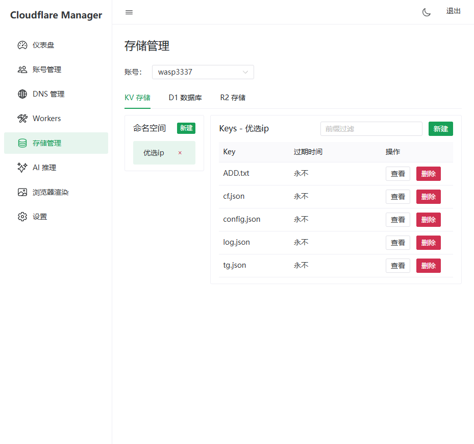
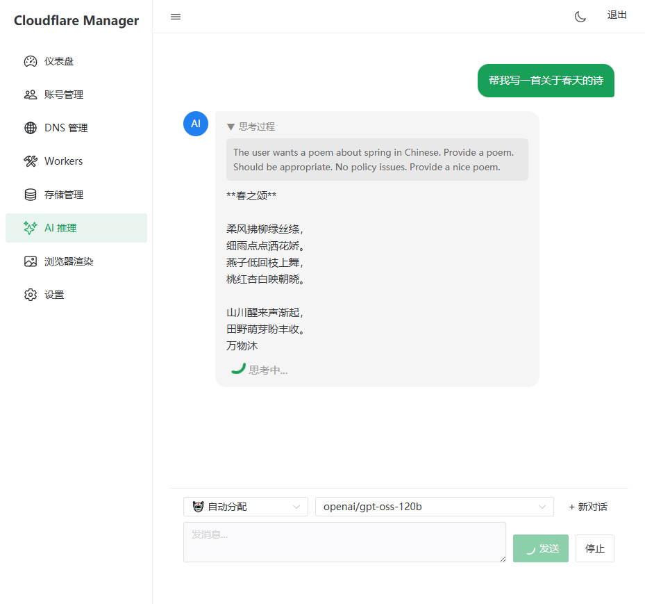
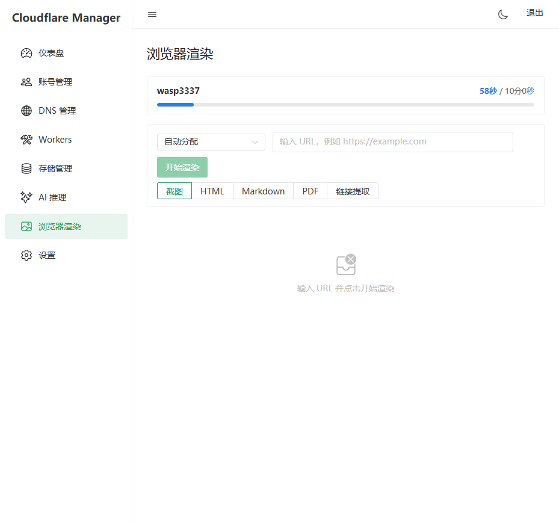
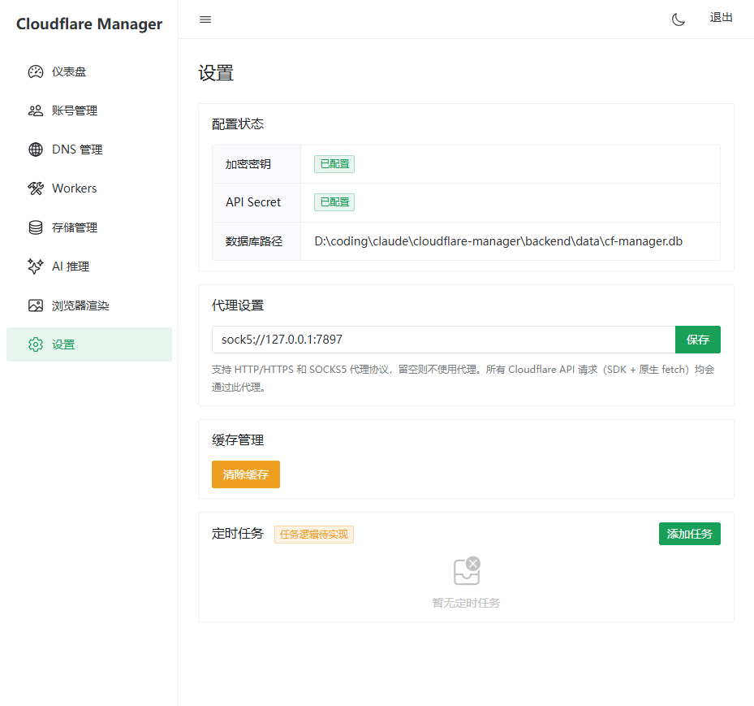

# CF Manager

一站式 Cloudflare 多账户管理平台。提供可视化界面统一管理 Workers、Pages、DNS、KV、D1、R2、AI 推理、浏览器渲染等服务，同时暴露 OpenAI 兼容 API 供外部项目调用。

## 功能特性

### 多账户管理
- 支持 API Token 和 Global API Key 两种认证方式，详见 [账户认证文档](docs/account-auth.md)
- 多账户统一管理，自动加密存储凭证
- AI 推理和浏览器渲染支持多账户自动轮换，配额耗尽自动切换

### 仪表盘
- 实时展示各账户今日配额使用量（Workers 请求数、AI 神经元、浏览器渲染时长）
- 可视化进度条和最近操作审计日志

### Workers / Pages 管理
- 查看、部署、删除 Workers 脚本和 Pages 项目
- 支持单个部署和跨账户批量部署（Workers + Pages）
- 管理脚本绑定、环境变量、路由、自定义域名
- Pages 部署历史查看和回滚

### DNS 管理
- 按域名查看和管理 DNS 记录（A / AAAA / CNAME / MX / TXT 等）
- 一键切换 Cloudflare 代理状态
- 批量操作支持

### 存储管理
- **KV 命名空间**：浏览键值对，支持创建/编辑/删除命名空间和键
- **D1 数据库**：管理数据库，SQL 查询执行，表结构创建/修改（添加列、重命名列、删除列、删除表）
- **R2 存储桶**：管理对象，支持文件上传/下载/删除，图片在线预览

### AI 推理
- 支持所有 Cloudflare Workers AI 模型
- 流式对话界面，Reasoning 模型思考过程实时展示
- 历史对话上下文支持
- 多账户自动轮换，配额耗尽无缝切换

### 浏览器渲染
- 支持 5 种渲染模式：截图、HTML 内容、Markdown 转换、PDF 生成、链接提取
- 多账户限速和配额管理
- 渲染时长实时统计

### OpenAI 兼容 API
- 暴露 `/v1/chat/completions` 和 `/v1/models` 接口
- 完全兼容 OpenAI SDK，可直接对接 Cursor、ChatGPT-Next-Web、Open WebUI 等工具
- 支持流式和非流式响应
- 浏览器渲染 API (`/v1/browser/render`)
- 详见 [API 文档](docs/api-v1.md)

### 系统设置
- 代理配置：支持 HTTP/HTTPS 和 SOCKS5 协议，所有 Cloudflare API 请求均走代理
- 缓存管理：一键清除 SDK 客户端和区域缓存
- 定时任务框架（可扩展）

### 安全特性
- API Token 加密存储（AES 加密）
- 可选的 API Secret 认证保护管理界面
- 操作审计日志

---

## ⚠️ 免责声明

本工具仅供学习和技术研究使用。使用本项目导致的任何账号封禁、IP 封禁或其他后果与本项目无关。

请务必严格遵守 Cloudflare 官方服务条款和使用协议，合理控制和限制调用量，避免过度请求或滥用 Cloudflare API。

---

## 快速开始

### Docker 部署（推荐）

```bash
# 1. 克隆项目
git clone <your-repo-url>
cd cf-manager

# 2. 创建配置文件
cp .env.example .env

# 3. 编辑 .env，至少设置 ENCRYPTION_KEY
#    可选设置 API_SECRET（管理界面登录密码）、PROXY_URL（代理地址）

# 4. 一键部署
chmod +x deploy.sh
./deploy.sh

# 5. 访问 http://localhost:3000
```

### 环境变量

| 变量 | 必填 | 说明 |
|---|---|---|
| `ENCRYPTION_KEY` | 是 | 加密存储 API Token 的密钥（任意随机字符串，至少 16 位） |
| `API_SECRET` | 否 | 管理界面访问密码，留空则无需登录 |
| `PROXY_URL` | 否 | HTTP/SOCKS5 代理地址，如 `http://127.0.0.1:7890` 或 `socks5://127.0.0.1:1080` |
| `APP_PORT` | 否 | 对外暴露端口，默认 `3000` |

### 本地开发

```bash
# 后端（http://localhost:3001）
cd backend
npm install
ENCRYPTION_KEY="dev-key" npm run dev

# 前端（http://localhost:5173，自动代理 /api 到后端）
cd frontend
npm install
npm run dev
```

---

## 技术栈

| 层级 | 技术 |
|---|---|
| 前端 | Vue 3 + Naive UI + Pinia + Vue Router |
| 后端 | Express 5 + TypeScript + Cloudflare SDK |
| 数据库 | SQLite (better-sqlite3) |
| 部署 | Docker Compose (nginx + Node.js) |

---

## 项目结构

```
cf-manager/
├── backend/                 # 后端 API 服务
│   └── src/
│       ├── index.ts         # Express 入口
│       ├── config.ts        # 配置
│       ├── db.ts            # SQLite 数据库
│       ├── middleware/      # 认证、错误处理、响应包装
│       ├── models/          # 数据模型
│       ├── routes/          # API 路由
│       └── services/        # 业务逻辑层（Cloudflare SDK 封装）
├── frontend/                # 前端 Vue 应用
│   └── src/
│       ├── api/             # API 调用封装
│       ├── views/           # 页面组件
│       ├── stores/          # Pinia 状态管理
│       └── utils/           # 工具函数
├── docker/                  # Docker 构建配置
│   ├── backend/Dockerfile
│   └── frontend/
│       ├── Dockerfile
│       └── nginx.conf
├── docs/                    # 文档
│   ├── api-v1.md            # 外部 API 接口文档
│   └── account-auth.md      # 账户认证方式说明
├── docker-compose.yml
├── deploy.sh                # 一键部署脚本
└── .env.example             # 环境变量模板
```

---

## 功能截图

### 仪表盘


### 账号管理


### Workers / Pages


### DNS 管理


### 存储管理（KV / D1 / R2）


### AI 推理


### 浏览器渲染


### 系统设置


---

## License

[MIT](LICENSE) © 2024 CF Manager Contributors
